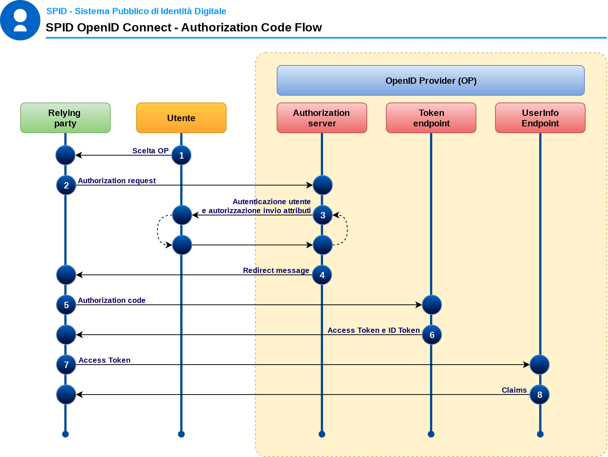
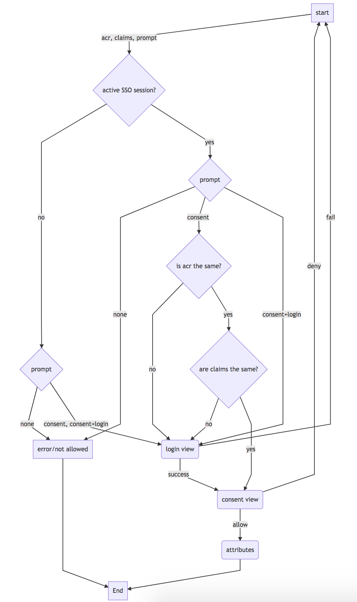

Flusso
======

Il modello di flusso è l’ "**OpenID Connect Authorization Code Flow**"
che è infatti l’unico flusso previsto da iGov.

L’Authorization code flow restituisce un codice di autorizzazione che
può essere scambiato per un ID token e/o un access token; Questo flusso
è anche la soluzione ideale per sessioni lunghe o aggiornabili
attraverso l’uso del refresh token. L’Authorization code flow ottiene
l’authorization code dall’authorization endpoint dell’OpenID Provider e
tutti i token sono restituiti dal token endpoint.

|image0|

+-----------------+-----------------+-----------------+-----------------+
| **#**           | **Da**          | **A**           | **Azione**      |
+-----------------+-----------------+-----------------+-----------------+
| *1*             | **Utente**      | **RP**          | L’Utente, nella |
|                 |                 |                 | pagina di       |
|                 |                 |                 | accesso del     |
|                 |                 |                 | Relying Party   |
|                 |                 |                 | (RP),           |
|                 |                 |                 | seleziona, sul  |
|                 |                 |                 | pulsante SPID,  |
|                 |                 |                 | l’OpenID        |
|                 |                 |                 | Provider (OP)   |
|                 |                 |                 | con cui         |
|                 |                 |                 | autenticarsi    |
+-----------------+-----------------+-----------------+-----------------+
| *2*             | **RP**          | **OP**          | Il Relying      |
|                 |                 |                 | Party (RP)      |
|                 |                 | **Authorization | prepara         |
|                 |                 | server**        | un’authenticati |
|                 |                 |                 | on              |
|                 |                 |                 | request e la    |
|                 |                 |                 | invia           |
|                 |                 |                 | all’Authorizati |
|                 |                 |                 | on              |
|                 |                 |                 | Endpoint        |
|                 |                 |                 | dell’OpendID    |
|                 |                 |                 | Provider        |
|                 |                 |                 | selezionato     |
|                 |                 |                 | dall’utente     |
+-----------------+-----------------+-----------------+-----------------+
| *3*             | **OP**          | **Utente**      | L’OpendID       |
|                 |                 |                 | Provider (OP)   |
|                 | **Authorization |                 | richiede        |
|                 | Server**        |                 | all’utente      |
|                 |                 |                 | l’inserimento   |
|                 |                 |                 | delle           |
|                 |                 |                 | credenziali,    |
|                 |                 |                 | secondo il      |
|                 |                 |                 | livello SPID    |
|                 |                 |                 | richiesto dal   |
|                 |                 |                 | Relying Party   |
|                 |                 |                 | (RP),           |
|                 |                 |                 | all’utente a    |
|                 |                 |                 | cui chiede, una |
|                 |                 |                 | volta           |
|                 |                 |                 | autenticato, di |
|                 |                 |                 | autorizzare gli |
|                 |                 |                 | attributi       |
|                 |                 |                 | richiesti dal   |
|                 |                 |                 | Relying Party   |
|                 |                 |                 | (RP)            |
+-----------------+-----------------+-----------------+-----------------+
| *4*             | **OP**          | **RP**          | L’OpenID        |
|                 |                 |                 | Provider        |
|                 | **Authorization |                 | reindirizza     |
|                 | **              |                 | l’utente verso  |
|                 |                 |                 | il Redirect URI |
|                 | **server**      |                 | specificato dal |
|                 |                 |                 | RP, passando un |
|                 |                 |                 | authorization   |
|                 |                 |                 | code            |
+-----------------+-----------------+-----------------+-----------------+
| *5*             | **RP**          | **OP**          | L’RP invia      |
|                 |                 |                 | l’authorization |
|                 |                 | **Token**       | code ricevuto   |
|                 |                 |                 | al Token        |
|                 |                 | **endpoint**    | endpoint        |
|                 |                 |                 | dell’OP         |
+-----------------+-----------------+-----------------+-----------------+
| *6*             | **OP**          | **RP**          | L’OP Token      |
|                 |                 |                 | endpoint        |
|                 | **Token**       |                 | rilascia un ID  |
|                 |                 |                 | Token, un       |
|                 | **endpoint**    |                 | Access token, e |
|                 |                 |                 | se richiesto un |
|                 |                 |                 | Refresh token   |
+-----------------+-----------------+-----------------+-----------------+
| *7*             | **RP**          | **UserInfo**    | L’RP valida     |
|                 |                 |                 | l’ID token e    |
|                 |                 | **endpoint**    | registra nella  |
|                 |                 |                 | propria         |
|                 |                 |                 | sessione tutti  |
|                 |                 |                 | i token         |
|                 |                 |                 | ricevuti. Per   |
|                 |                 |                 | chiedere gli    |
|                 |                 |                 | attributi che   |
|                 |                 |                 | erano stati     |
|                 |                 |                 | autorizzati     |
|                 |                 |                 | dall’utente al  |
|                 |                 |                 | punto 3, invia  |
|                 |                 |                 | l’Access token  |
|                 |                 |                 | allo UserInfo   |
|                 |                 |                 | endpoint        |
|                 |                 |                 | dell’OP         |
+-----------------+-----------------+-----------------+-----------------+
| *8*             | **OP**          | **RP**          | L’OP rilascia   |
|                 |                 |                 | gli attributi   |
|                 | **User**        |                 | richiesti       |
|                 |                 |                 |                 |
|                 | **endpoint**    |                 |                 |
+-----------------+-----------------+-----------------+-----------------+

|image1|

.. toctree::
  :maxdepth: 3
  :caption: Indice dei contenuti

  flusso/applicazioni-per-dispositivi-mobili.rst

